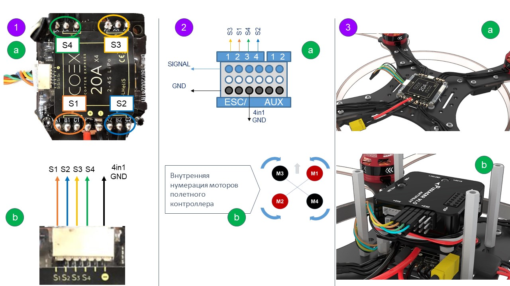

# Connecting 4 in 1 ESCs

## 4 in 1 ESC circuit board pin-out

Appropriate phase wires and their control signal (Fig. 1b) are marked with the same color (Fig. 1a).

For example, orange color -> bottom-right motor -> S1 - orange wire.

## Pixracer flight controller pin-out

Fig. 2a shows the pin-out of the terminal strip:

* **SIGNAL** — ESC connection. Every pin has its own signal. Pins 5 and 6 can receive a PWM signal (for example, a servo may be connected).
* **GND** is the ground of the flight controller. A common bus on all GND pins (marked in black).
* 1, 2, 3, 4 are ports for connecting ESCs.
* 1, 2 are ports for expanding the output PWM signal (can be setup in QGroundControl, can also can be used to control the hexacopter).

    Fig. 2b shows motor numbering of the Pixracer flight controller.

* The arrow is the flight controller orientation.
* Black M3, M4 are the motors that rotate clockwise.
* Red M1, M2 are the motors that rotate counter-clockwise.

## Picture of the connection, based on the current orientation of the 4 in 1 ESC board

Using Fig. 1a, 1b, 2a, 2b, map its own control signal to each motor, and connect in accordance with the Pixracer motor numbering order.

For example, motor M3 that rotates counter-clockwise (top left corner) is controlled by signal S4 (green wire). It is connected to port 3.

