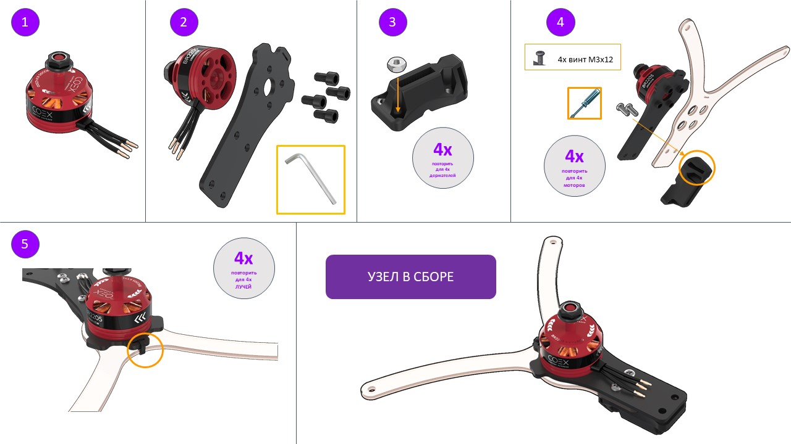
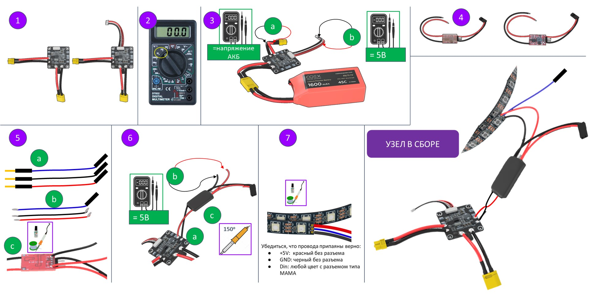
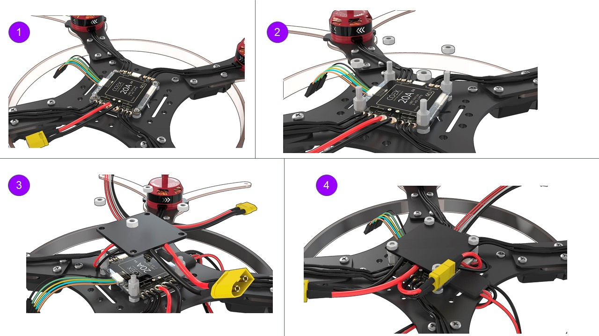
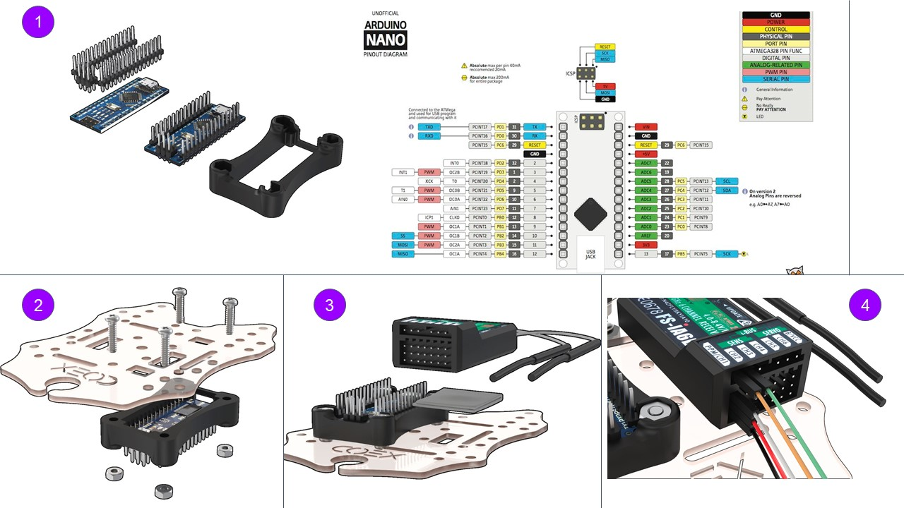

# Assembly of Clever 3

This manual discusses the assembly of the COEX Clever 3 kit with a 4 in 1 EDC circuit-board.

> **Caution** Before using soldering equipment, be sure to read the [safety precautions when soldering](tb.md).

<!--
## The drone kit contents

TODO
-->

## Additional equipment

## Conventional symbols

## Installation of motors

1. Unpack the motors.
2. Attach a motor to the beam with М3х6 hex screws (the shortest screws supplied with the motors).

    A hex wrench included.

3. Insert M3 nuts (4 pcs) into the plastic holder.

    For convenience, you can use a long screw or pliers

4. Secure the beam, the lower beam guard and the holder with М3х12 screws, using a Phillips screwdriver.
5. Using a clamp connect the beam and the bottom guard of the beam.

    Cut the remaining part of the clamp (tie wrap) with scissors.

    

## Installation of frame elements

1. Insert the M3 plastic nuts (4 pcs) for mounting the PDB on the frame with М3х8 screws.
2. Install 6 mm legs (4 pcs) for attaching the Raspberry Pi to the frame with М3х8 screws.
3. Attach the assembled unit to the frame with М3х16 screws, complying with the layout.
4. Install the frame for the LED strip, using the slots in the leg holders.

## Installation of the BEC voltage converter (to be soldered and tested)

1. Unpack the power board and install the power flat cable.
2. Switch the multimeter in the DC voltage measurement mode (20V or 200V range).
3. Check operation of the power board by connecting the battery
    * Output voltage at the XT30 connector should be equal to the battery voltage (10 V to 12.6 V).
    * The output voltage at the power flat cable should be between 4.9 V to 5.3 V.
    * To be measured between the black and the red wires.
4. Unpack the voltage converter and remove the transparent insulation.
5. Solder two additional wires to the BEC
    * Take 3 male-female wires from the kit (red, black, and any color)
    * The red and black wires [are to be blanched](zap.md) on both ends using tweezers. The blue wire is to be blanched from the side of the MALE connector.

        To blanch means:
        * Apply flux to the exposed part of the wire.
        * Cover with solder.

    * Solder the red and the black wires to BEC:

            BLACK -> OUT-
            RED -> OUT+

6. Check BEC operation.
    * Solder the BEC to the power board:

            BLACK -> -
            RED -> +

    * Connect the battery and check the voltage at the wires soldered to BEC (from step 5).

        5 V - everything is okay!

        more than 10 V - disconnect the power and move the yellow jumper to the other tweezers.

        0 V - poorly soldered.
    * If the BEC outputs 5 V, isolate the soldered connection with a black thermal contraction tube.
7. Installation of the LED strip.

    * Solder the wires from BEC (from step 5) to the LED strip.
    * Remove the silicone layer on the strip (make an incision with a knife and tear).
    * [Blanch](zap.md) the contacts of the LED strip.

            Red -> +5V
            Black -> GND
            Blue -> Din

## Installation of the 4 in 1 ESC board and the PDB power-board

1. Install the 4 in 1 ESC circuit-board as shown in the picture.

    Connect the phase wires of the motors with ESCs wires.

2. Attach the ESC board with 6 mm legs (4 pcs.).

    Screw M3 plastic nuts (4 PCs.) to the legs.

3. Install the PDB power distribution board as shown in the picture (the XT60 connector should point to the tail of the copter).
4. Connect the wires of the PCB power supply board and ESC XT30 board.

 

## Pairing the receiver and transmitter

1. Connect the 5V wire from BEC to the connector of the receiver.

    Insert the BIND connector into the rightmost B/VCC port.

2. Connect the battery. The indicator on the receiver should flash rapidly (reset mode).
3. Press and hold the BIND button on the remote, and switch the remote on.

    The RXBinding process will be displayed on the remote.

4. After pairing (additional lines will be displayed on the remote):
    * Remove the BIND connector from the receiver.
    * Disconnect the battery.

> **Hint** If the remote cannot be powered on, or is blocked, see
article [remote faults](radioerrors.md).

## Checking the motors rotation direction

1. Turn the transmitter ON

    Make sure PPM in the RX Setup menu is disabled ([section "No communications with the flight controller"](radioerrors.md))

    In point 3, select “RX setup” > “PPM OUTPUT” > “Off”.

    Save changes (hold pressed the “CANCEL” button).

2. Connect the S1 orange wire from the ESC board to CH3 on the receiver. Connect external power.
3. Using the left stick, set throttle to 10 %.
4. Check the motor rotation direction according to the scheme. Repeat for each motor. Thus, it will be clear which motor is controlled.
5. If you have to change the rotation direction, toggle any two phase wires of the motor (needs re-connection).

## Installation and connection of the Pixracer flight controller

1. Install the Pixracer flight controller on double-sided 3M adhesive tape (2 – 3 layers).
    The flight controller may also be removed from the housing and rigidly mounted on the М3х6 leg.

2. Install 40 mm legs using М3х87 screws.

    Connect the POWER connector.

3. Connect ESCs as shown in the picture.

    More [about connecting 4 in 1 ESCs](4in1.md).

4. Connect the flat cable from the radio receiver to the RCIN connector in Pixracer.

## Installation of Raspberry

1. Turn the copter upside down.

    Install Raspberry on the legs using Raspberry mounting holes.

    USB connectors should point to the tail of the copter.

2. Installation of the flat cable for the camera:
    * lift the latch;
    * connect the flat cable;
    * close the latch.
3. Connecting Raspberry power:

        5V -> pin 04 (DC power 5 V)
        GND -> pin 06 (Ground)
        Connecting the LED strip pin 40 (GPIO21)

4. Assembling the mount for the RPi camera.

    Use an М3х16 screw and an M3 nut

## Installation of Arduino and the FlySky radio receiver

1. Mount the pins of the Arduino Nano micro-controller using soldering.
2. Install the micro-controller into a special mount, and attach to the lower deck using М3х16 screws (4 pcs).
3. Using double-sided tape, attach the receiver as shown in the picture.
4. Connect the flat cable from the radio receiver to Pixracer as shown in the picture.

        white -> PPM
        red -> 5V
        black -> GND
        orange, green -> currently not used. They are set to the unused pins of the radio receiver

## Installation of the RPi camera

1. Attach the mount for the RPi camera assembly to the lower deck with М3х12 screws (2 pcs.)
2. Connect the flat cable to the RPi camera.
3. Install the camera into the mount, secure it with M2 self-tappers.
4. Attach Raspberry with 30 mm legs (4 pcs.).

    Attach the lower deck assembly to the rack with М3х8 screws (4 pcs.)

5. Install the legs into the mounts (4 pcs).

## Installation of the remaining structural elements

1. Install the bottom guard using М3х12 screws (8 units) and the 30 mm legs (8 pcs).
2. Install the top guard using М3х12 screws (8 pcs).
3. Insert the strap into the upper deck for attaching the battery.

    Secure the upper deck with М3х8 screws (4 pcs.)

## Installation of USB connectors

1. Connect Pixracer to Raspberry using the micro USB - USB cable.
2. Connect Arduino to Raspberry using the micro USB - USB cable.

.

Read more about connection in [article](connection.md).
