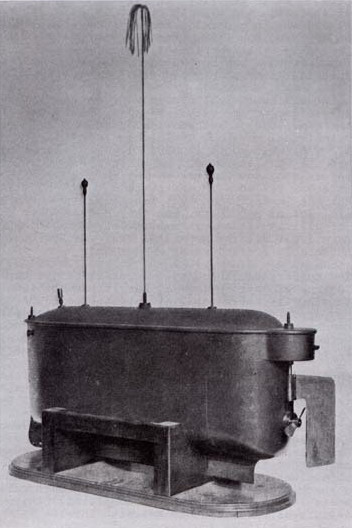
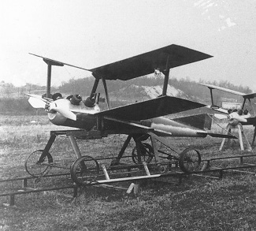
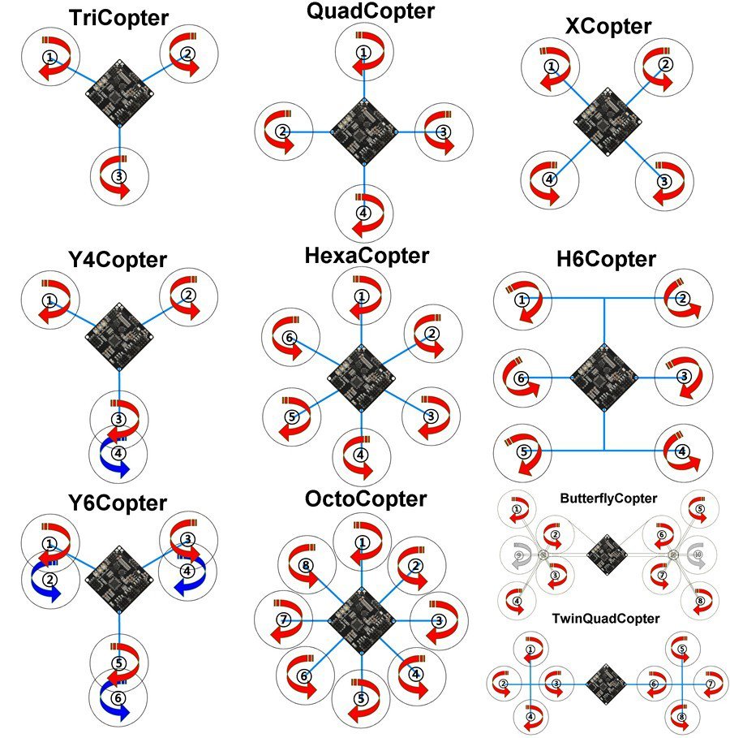
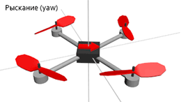
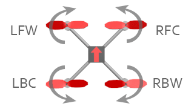

Lesson 1: "Introduction. Principles of designing and building multicopters"
========================================================================

The first drones
-------------------

The impetus for the emergence of remotely operated machines was discovery of electricity and invention of radio. On August 22, 1849, the Austrian army used balloons controlled by wires for bombing Venice. In 1892, the Sims-Edison Electric Torpedo Company presented an anti-ship torpedo controlled by wires. In 1897, a British Ernest Wilson patented a system for wireless control of a zeppelin; however, there is no information about building such a mechanism.

In 1899, engineer and inventor Nikola Tesla demonstrated a radio-controlled miniature boat at an exhibition at Madison Square garden. Despite the fact that the public was primarily interested in military use of his invention, Tesla himself pointed to the potentially much wider use of remote control (called "teleautomatics" by the inventor), for example, in anthropomorphic automatons.

### Kettering's Beetle

An experimental unmanned "air torpedo", one of the first predecessor project of the modern cruise missiles. Developed by inventor Charles Kettering and commissioned by the U.S. Army in 1917, it was intended for bombardment of cities, large industrial centers and places of enemy forces concentration  from the distance of up to 120 km. It featured a simple design and a very low price. Although the unit passed testing with relative success, the First World War ended, and the projectile remained experimental.

### Bothezat's helicopter

Multi-propeller helicopters were developed in the early years of the helicopter industry. One of the first quadcopters a four-propeller helicopter, which really took off the ground and could stay in the air, was built by George Bothezat, and was tested in 1922. The disadvantage of these aircraft was the complicated transmission that transmitted rotation from a single motor to several propellers. The invention of the tail rotor and the swashplate put an end to these attempts. New developments started in 1950-s, but did not go beyond the prototypes.

UAV types
---------

An Unmanned Aerial Vehicle (UAV) is an aircraft flying without a pilot (crew) on board, and controlled during flight automatically, by an operator in a control room, or by a combination of these methods. The main classes of such aircraft are UAVs of the airplane and copter types.

Airplane-type UAVs
---------------------

This type of aircraft is also known as fixed-wing UAV. The lifting force of such aircraft is created aerodynamically by the air pressure moving against a fixed wing. Aircraft of this type are usually characterized by longer flight duration, high maximum altitude, and high speed.
There are many subtypes of airplane-type UAVs with various shapes of the wings and the fuselage. Almost all airplane layouts and types of fuselage that are found in manned aircraft may also apply to unmanned ones.

Application of the airplane-type UAVs
--------------------------------

Airplane-type UAVs can cover much larger areas than conventional copters, thanks to the ability to stay in the air for a long time and to develop high speed; however, their price significantly exceeds the price of conventional copters. The main disadvantage of such aircraft (except for the price) - is the fact that the quality of the picture may degrade due to speed, such aircraft often cannot take pictures of the three-dimensional/topographic details.
The areas of use:

* Aerial photography (when there is a need of capturing the terrain at a long distance);
* Military use (heavy UAVs with long flight duration — the take-off weight more than 1,500 kg, the range about 1,500 km);
* Agriculture (spreading fertilizers, field monitoring);
* Security and area monitoring.

Application of copters
-------------------

An Unmanned Aerial Vehicle (UAV) is an aircraft flying without a pilot (crew) on board, and controlled during flight automatically, by an operator in the control room, or by a combination of these methods. It is widely used in various fields:

* Telecom sphere (the use of two-way video / audio communication)
* Transportation (transportation of cargo);
* Rescue missions (investigating hard-to-reach areas during natural disasters, terrorist attacks, searching for people under debris, transportation of medicines, providing first aid in case of accidents);
* Advertising campaigns (the use of a robot for attracting attention at large fairs, etc.);
* Media (aerial photography of various events);
* Video/photo shooting (shooting of movies or commercials from a bird's-eye view);
* Food industry (delivery of food products).

Types and configuration
-------------------

There are many engines configurations: a tricopter, a hexacopter, or an octocopter, but the simplest one in terms of assembly and operation is a quadcopter, i. e., a multi-rotor platform with four engines. In turn, a quadcopter may have + and х configuration. In copters with a "+" configuration, one of the beams faces forward, while in platforms with the "x" configuration, the main direction of movement is between two adjacent beams.

Control
----------

The copter is controlled from a transmitter that sends commands to the radio receiver. The transmitter is powered by batteries, and the radio receiver is powered from the flight controller. The communication is often one-way, from the transmitter to the receiver. The receiver is connected to the flight controller with at least five wires which are used for transmitting the turn signals around 3 axes, the throttle command, and the flight mode command.

**Throttle** — translated as "throttle", "thrust", or "gas" in everyday life. A multicopter throttle is the mean arithmetical between the rotation speeds of all motors is it more the throttle, the higher the total thrust of the engines, and the stronger they pull the copter upwards (in other words, "Step on it" means the fastest ascent possible). It is usually measured as percentage: 0 % — the motors are stopped, 100 % — the motors are rotating at maximum speed. Hovering throttle is the minimum throttle required for the copter to stay at certain altitude.

The axes of the copter (pitch, roll, and yaw) are the angles used to determine and set the quadcopter orientation in space.

**Yaw** The multicopter nose turn. conditionally — turning right or left

**Pitch**. In copters, manipulation with this moment of force allows the copter to move forward or backward due to tilting the nose in the appropriate direction

**Roll** Multicopter tilting to the left or to the right. Due to the roll, the copter can move sideways in the appropriate direction.

If you can control throttle, pitch, roll and yaw, you can control the quadcopter. They are also sometimes called control channels. There are many flight modes. GPS, barometer, and distance gage are also used, as well as stabilization mode (stab, stabilize, flying and stab), in which the copter keeps the angles set from the transmitter regardless of external factors. Without wind, the copter can hang almost in place in this mode. And the wind will have to be compensated for by the pilot.
The propellers rotation directions are not chosen randomly. If all motors rotated in the same direction, the quadcopter would rotate in the opposite direction due to the generated moments. Therefore, two opposite motors always rotate in the same direction, and other two motors rotate the opposite direction. The effect of rotation moments is used to change the yaw: one pair of motors starts rotating a bit faster than the other, and the quadcopter slowly turns towards us:

  LFW — left front clockwise rotation

  RFC — right front counter clockwise rotation

  LBC — left back counter clockwise rotation

  RBW — right back clockwise rotation

  

Elements of the copter
----------------

Usually, when it comes to controlling a model of boat or an aircraft, the operator has absolute, precise control over the engine. Pressing the joystick on the transmitter results in proportional increasing the speed of the screws (rpm). A distinctive feature of multi-propeller aircraft (regardless of whether it is an advantage or a disadvantage) is in the fact that no one can simultaneously control the rotation speed of 3 and more motors precisely enough to keep the aircraft in the air. That is where the flight controllers come into play.

**Flight controller** is the most important part. Ninety percent of flight stability and controllability depends on the characteristics of the flight controller.
A flight controller is intended for translating commands from the transmitter into the signals that set the rotation speed of the motor. It also has inertial measuring sensors that allow keeping an eye on the current position of the platform and performing automatic adjustment

**ESC** are regulators for adjusting the motors rotation. The fact is that multi copters use special brushless motors that can rotate at very high speeds. To control such motors, it is sometimes necessary to form three phase voltage and relatively high currents, which is performed by ESCs. Each motor requires its own ESC. All ESCs are connected to the flight controller. The ESCs are powered directly from the battery. Each motor is connected to its own ESC with three wires. The order of connecting the wires determines the direction of motor rotation.

**Motor**. Copters use brushless motors. They feature outstanding characteristics and survivability due to the absence of friction units (brushes) for transmitting the current. Unlike a conventional motor, which has a moving part — the rotor, and a stationary part — the stator, in a brushless motor, the moving part is the stator with permanent magnets, and the stationary part is the rotor with windings of three phases. In order to rotate such a system, the direction of the magnetic field in the windings of the rotor is changed in specific order, whereby permanent magnets in the rotor interact with magnetic fields of the stator and start rotating. This rotation is caused by the ability of magnets with the same poles to repel from each other, and magnets with opposite poles to attract to each other.

**Radio control equipment**. It includes a transmitter with a control unit, and a receiver. They may have various numbers of channels and frequencies. Most transmitters operate at the frequency of 2.40 GHz, there are also several other frequency bands available in the market.

**Propeller** is the blade rotated by the motor and used for converting the torque of the motor into the thrust. Blades of the propeller grab the air and throw it in the direction opposite to the direction of movement. In front of the propeller, a zone of low pressure is created, while behind the propeller, a zone of increased pressure is created. This creates the lifting force.
The propeller has the following characteristics:

1. Diameter;

2. Propeller pitch is one of the main technical characteristics of an air or water propeller, depending on the angle of its blades relative to the plane of circular rotation in a gas or liquid medium; it is the distance traveled forward by the screw in a solid medium in one complete revolution (360°);

3. Material.

### Battery

Powers the ESCs and the flight controller. Special lithium polymer batteries are used in copters.
The main battery characteristics are:

* Capacity (mA*h);

* Maximum discharge (20C);

* The number of cells (2S,3S, 4S);

* Weight.

### Power frame

Usually made of plastic or composite materials.

### Reference questions

1. When did the first quadcopter appear, and what were its disadvantages?
2. In what spheres may copters be used?
3. What quadcopter configurations are there?
4. List the names of copter's axes.
5. What is the principle of copter propellers rotation?
6. What is the flight controller responsible for?
7. What is the purpose of ESC?
8. What kind of electric motors is used in copters? What is their advantage?
9. What are the three parameters of air screws?
10. Will a quadcopter be able to fly in the vacuum?
