# Pre-configuration of the quadcopter

## Composition of the FLYSKY i6 transmitter

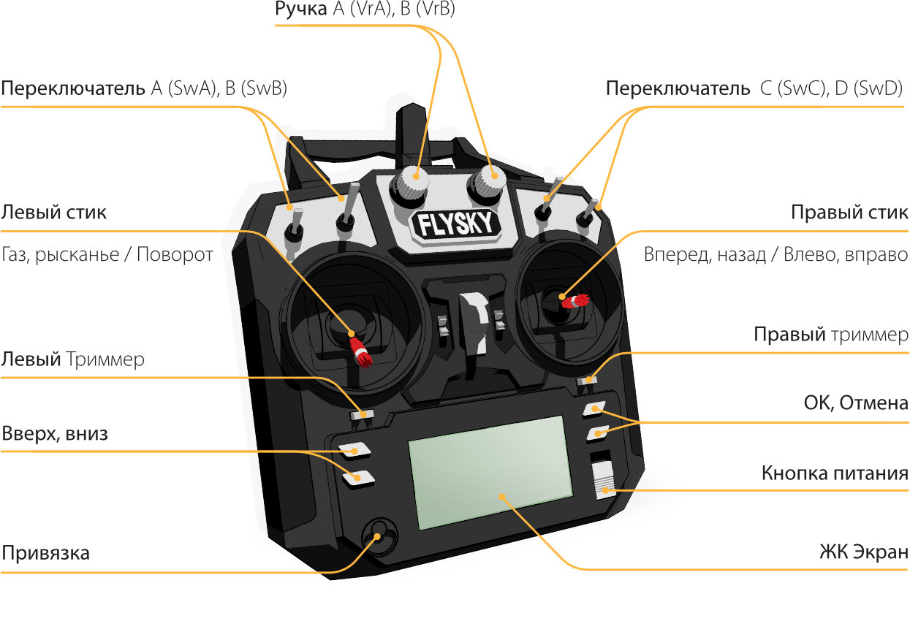

## Installation of QGroundControl

* Download the installation file for Windows/iOS by following the link [QGroundCongtrol](http://qgroundcontrol.com/downloads/).
* Agree to install drivers during installation

## Formatting the memory card

* Install the microSD card into the adapter.
* Format the card to FAT32
  right click on the disk > Format.
* Run "Safely remove" the card in the tools, then extract the card.
* Insert the microSD card into the Pihxawk flight controller.

## Pihxawk firmware update

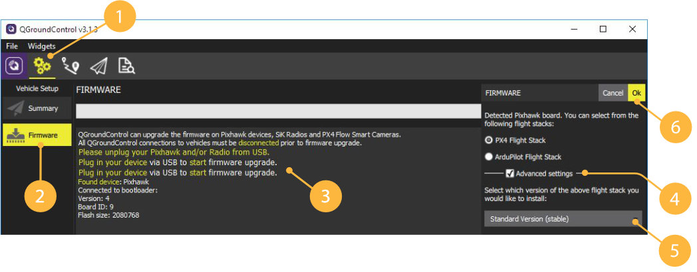

1. Go to Vehicle Setup.
2. Choose Firmware.
3. Disconnect Pihxawk from the USB. Connect Pihxawk to the USB again.
4. Waiting for Pihxawk to connect, select firmware PX4 Flight Stack, and activate the Advanced settings.
5. Select firmware type Standard Version (stable). If you load your own firmware/ an external firmware file (e.g., downloaded from the Internet), then choose Customize from the drop-down menu.
6. Click OK. Wait for loading.
7. Wait for Pihxawk to reboot.

## Configuration of Pihxawk

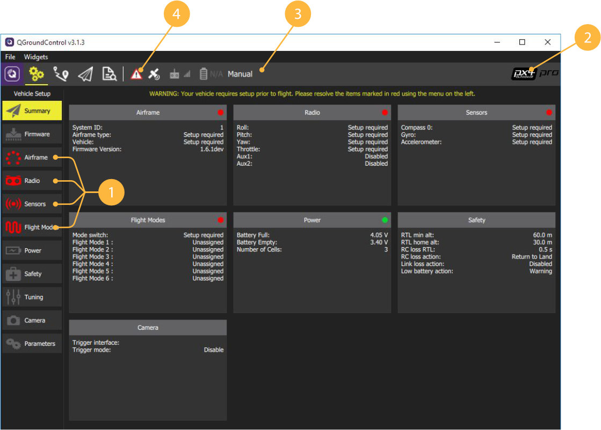

1. Systems that need configuration: Airframe, Radio, Sensors, Flight Mode
2. Current controller firmware.
3. Current flight mode.
4. Error messages.

## Choice of the frame

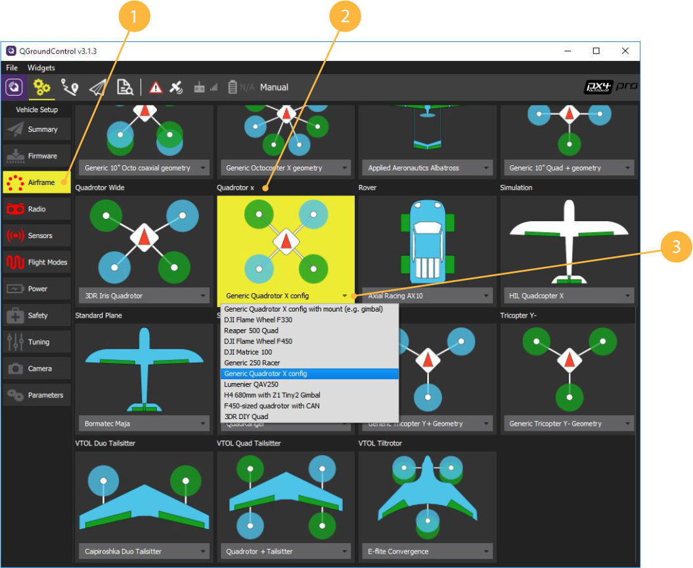

1. Go to the Airframe menu.
2. Choose frame type Quadrotor X.
3. Select the hook-up elements type Generic Quadrotor X config.
4. Move to the top of the list and save the Apply and Restart settings.

   

5. Re-confirm Apply.
6. Wait for Pihxawk to complete save and reboot.

## Connecting the transmitter

Before calibrating, make sure that

* External power is not connected to the copter.
* Propellers are not installed on the motors.

1. Go to the Radio menu.
2. Turn on the transmitter by turning the Power switch to the top position.
3. Next, make sure that communication with the receiver is established:

The LCD of the transmitter shows the following indication:

The LED on the receiver remains red continuously:

In case of communication problems, click [here](radioerrors.md)

## Configuration of performance channels

Channels CH5 and CH6 are required for configuring the flight of the copter.
Assign channel CH5 to the SwC three-position switch — it will change the flight modes
Assign channel CH6 to the SwA two-position switch — emergency stop of the motors.

To reassign the switches, follow these steps:

1. Go to MENU (by holding down the “OK” button)
2. Select menu “Functions setup” (Up/Down Button to navigate, OK button - to confirms the choice).
3. Select “Aux. channels”
4. Select:
   1. Channel 5 - SwC.
   2. Channel 6 - SwA.
5. Save changes (hold pressed the “CANCEL” button).

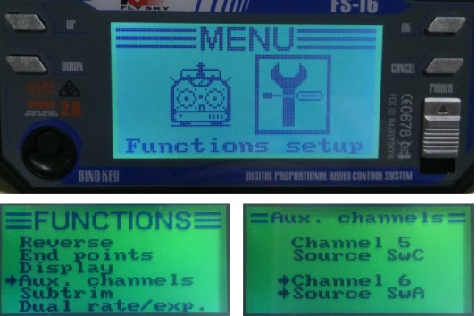

## Calibration of the transmitter

Start the calibration procedure

1. Press the Calibrate button
2. Set trimmers Throttle, Yaw, Pitch, and Roll to 0.
   * Trimmers allow setting the copter offset.
   * To set one of the trimmers to 0, move the pointer on the transmitter to the center until a long beep (squeak) is heard.
3. Press OK.

    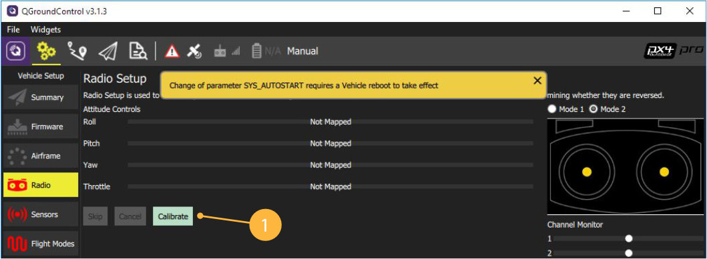

4. Move the Left stick (throttle) to the minimum and click Next
5. Calibration of the control channels (throttle, yaw, pitch, and roll).
 Move the sticks after the animation, and read hints.
6. Calibration of switches.
 After message "Move all transmitter switches and/or dials back and forth to their extreme positions" appears, switch SwA..SwD, VrA, VrB in their end position.
 Click Next
7. Saving parameters.
 When message "All settings have been captured. Click Next to write the new parameters to your board" appears,
  Click Next

8. Transmitter calibration is complete!

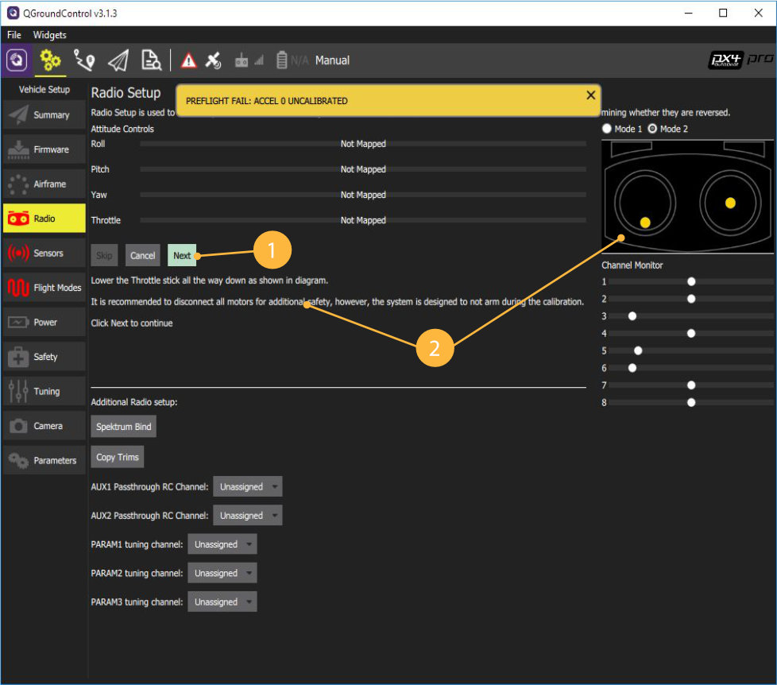

## Accelerometer calibration

1. Go to the Sensors > Accelerometer menu
2. Since Pihxawk points to the nose of the drone, select Autopilot Orientation: ROTATION_NONE. Click OK.

   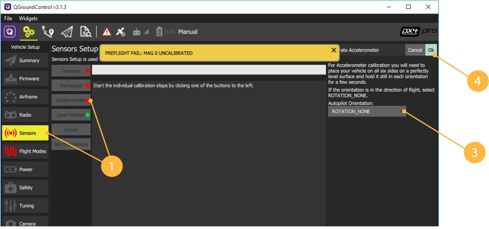

3. Start the calibration:
   Consistently place the drone as shown in the pictures, when Pihxawk captures the position, you will see a yellow frame around the picture — hold the drone in this position until the frame switches to green

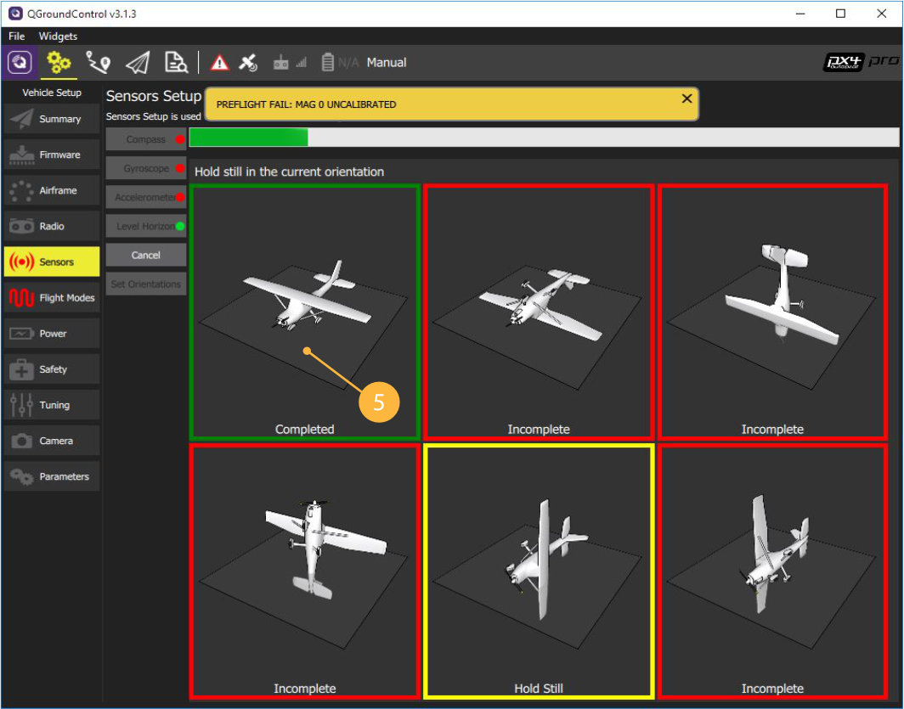

## Compass calibration

1. Go to the Sensors > Compass menu
2. Since Pihxawk points to the nose of the drone, select Autopilot Orientation: ROTATION_NONE. Click OK.
3. Position the drone as shown in the picture and wait for Pihxawk to determine the drone position until you see a yellow frame and the "Rotate" message.
4. Rotate the drone as shown in the picture until you see a green frame — Pihxawk will have recalibrated the compass along this axis.

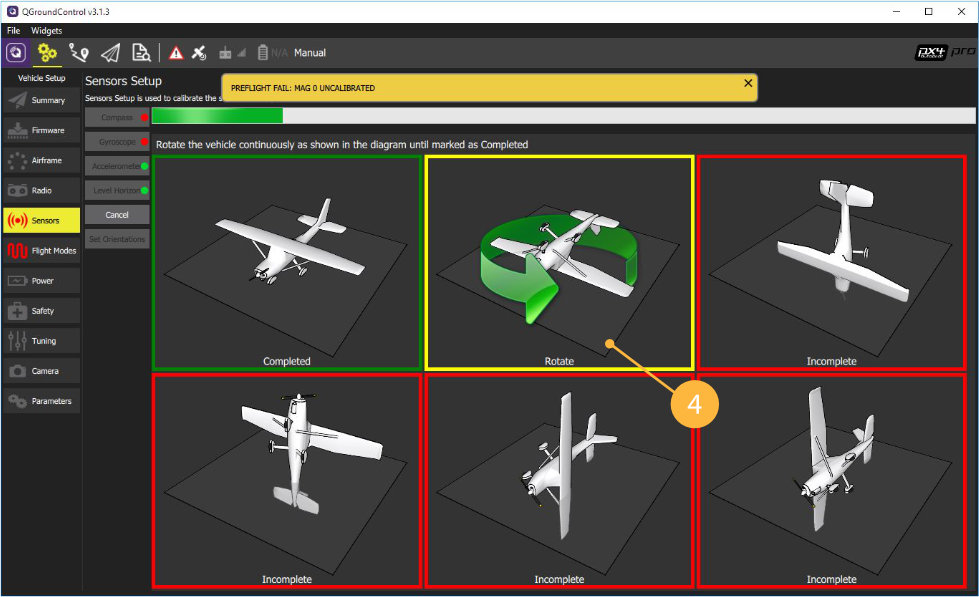

## Calibration of the gyroscope

1. Go to the Sensors > Gyroscope menu
2. Place the drone on a level surface and click OK.
3. Wait for the calibration to complete.

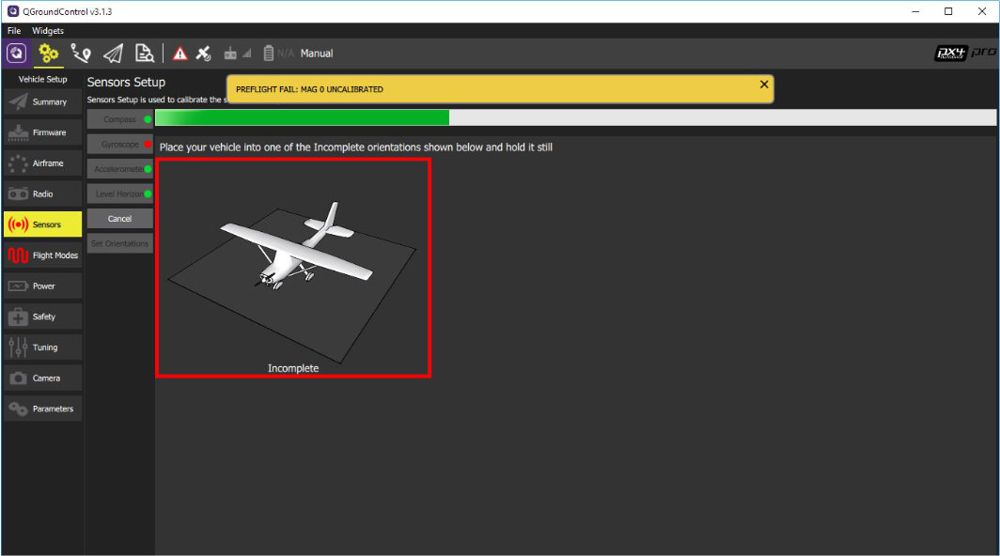

> *Warning* During calibration, the drone should remain in position, be stable, etc.

## Flight modes

1. Go to the Flight Modes menu.
2. Set channel selector on the SwC switch (Channel 5)
   Mode channel — Channel 5.
3. When the SwC is switched, the current mode is highlighted in yellow.
4. Assign flight modes:
    * Flight Mode 1: Stabilized.
    * Flight Mode 4: Altitude.
    * Flight Mode 6: Position.
5. Displaying the current flight mode.
6. Emergency shutdown of motors is to be assigned to the SwA switch (Channel 6).
   Kill switch - Channel 6

## Disabling the Safety Switch

The Pihxawk flight controller features motor protection from accidental use.
To unlock the copter, disable the safety button

1. Go to the Parameters > Circuit Breaker menu
2. Select parameter CBRK_AIRSPD_CHK, set the maximum value of the parameter (specified in line Maximum Value in the Parameter Editor window)
3. Save the values by clicking Save
4. Repeat setting the maximum values for all parameters, except for CBRK_RATE_CTRL and CBRK_VELPOSERR

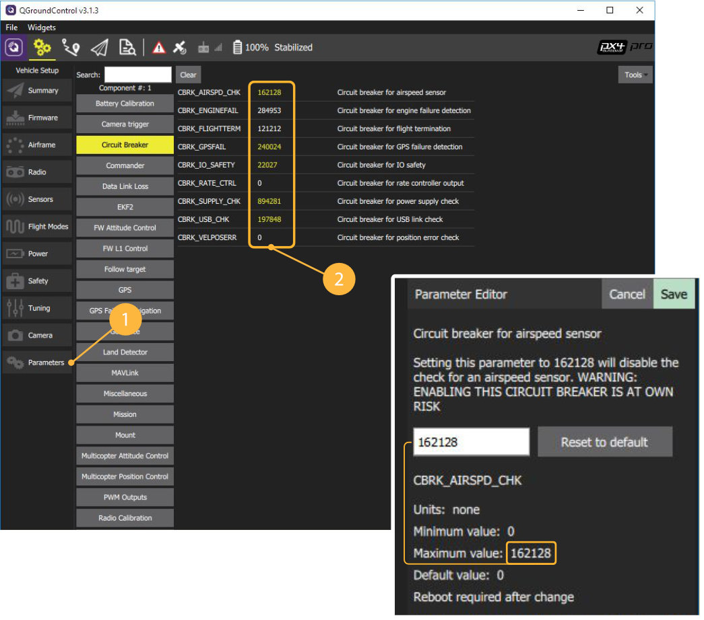

## ESCs calibration

1. Go to the Power menu.
2. Set the Number of cells — 4S.
3. Set parameter Full Voltage (per cell) - 4.20 V.

    To save the changes, restart Pihxawk:

    * Disconnect Pihxawk from the USB.
    * Connect Pihxawk to the USB again.

4. Make sure that the battery is disconnected and the propellers are removed
   Press Calibrate

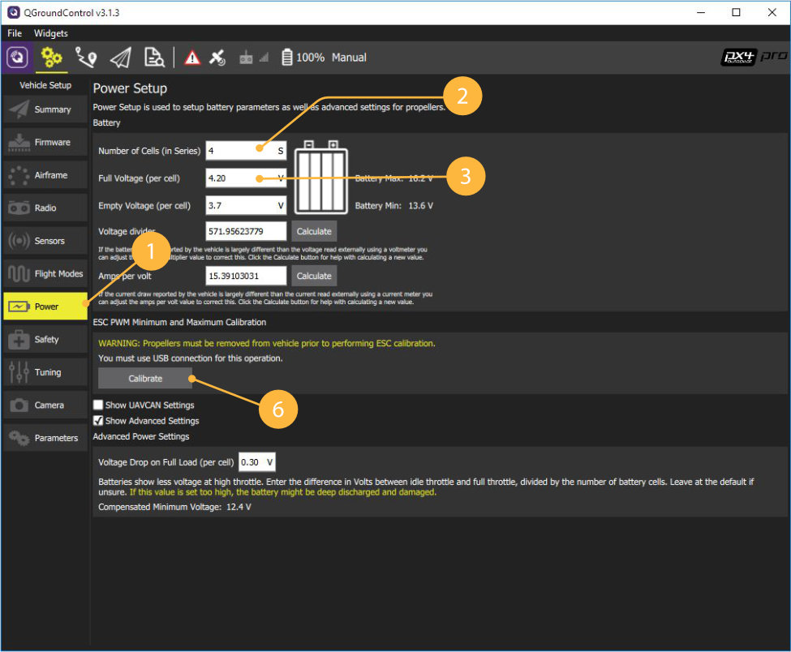

## PID regulator setup

 If during the flight, the quadcopter oscillates (fluctuates) and cannot therefore fly properly, it is necessary to [adjust coefficients of the PID regulator](calibratePID.md)

 By default, Clever 2 quadcopter uses the following coefficients:

1. Go to the Parameters > Attitude Control Multicopter menu
2. Set selected values of the PID regulator parameters for the Roll and Pitch angles:

* MC_PITCHRATE_P: 0.145
* MC_PITCHRATE_I: 0.050
* MC_PITCHRATE_D: 0.0025

* MC_ROLLRATE_P: 0.145
* MC_ROLLRATE_I: 0.050
* MC_ROLLRATE_D: 0.0025

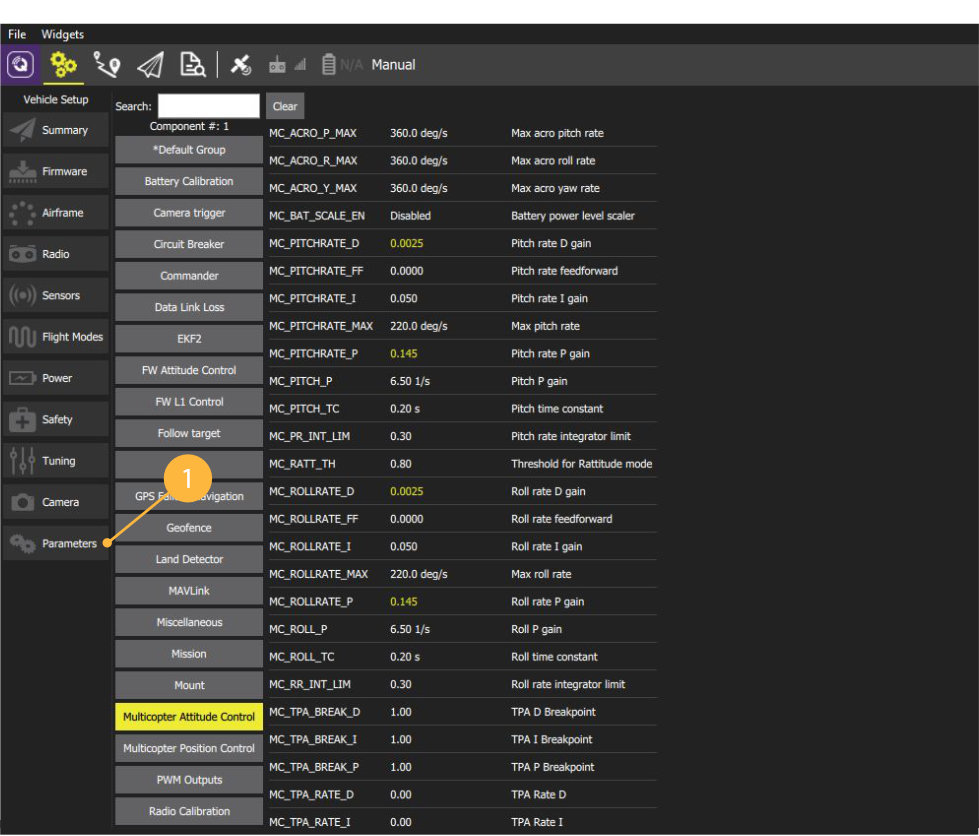

## Safety instruction

### Safety during pre-flight preparation

* Make sure that the Li-ion batteries are charged.
* Make sure the batteries in the control equipment are charged.
* Attach the propellers immediately before flying.
* Check reliability of the following units:
    1. Tightness of propeller nuts.
    2. Attachment and integrity of propellers guards.
    3. Reliability of wires attachment, absence of loose wires.

### Safety before flying

* Place the spectators behind the pilot, or behind the line passing through both shoulders of the pilot behind the pilot.
* Not to allow spectators into the hemisphere in front of the pilot.
* Know and remember the flight duration the copter and its battery are designed for.

* BEFORE connecting the Li-ion battery enable control equipment (the remote), and set the left stick (throttle) to the zero position.
* Connect the Li-ion battery immediately before takeoff, disconnect it immediately after landing.
* Stay at least 3 m away from the copter.
* Take off from a level flat site at the distance at least 3 meters away from obstacles.

### Flight safety

* Follow all instructions of the teacher or the flight instructor.
* Specify the flying area in advance. Only fly in the specified area, and avoid flying outside it. Do not fly behind your back.
* When learning to fly, fly below the level of your height.
* Fly in proximity to yourself at a distance at which you can see the copter orientation in space. Do not fly far away from yourself. If you doubt copter orientation, immediately land on the spot. Do not try to take off. Approach the copter and take off.
* During the flight, move the control sticks carefully and smoothly. Avoid abrupt movements. If you have to change the flight direction, move the sticks vigorously, but not abruptly.
* Fly carefully, and make only those flight elements that you are sure you can perform. Never perform the flight maneuvers that you doubt you can perform, and the maneuvers that involve risks.
* Observe the speed limit. The copter speed should be maintained within the speed of a walking man.
* Return the copter to the landing location by the estimated time, prevent complete discharge of the battery during the flight.
* Land only on a flat open area away from obstacles.

### Emergency landing

In case of hitting the ground or a heavy landing, do the following:

1. Stop the flight. Land the copter on the ground. Set the left stick (throttle) to the minimum.
2. Disarm (Move the left stick left-down for 3 seconds)
3. Disconnect the Li-ion battery on the copter.
4. Turn off the remote.
5. Inspect the copter, and repair if necessary.

### Scheduled landing

After a scheduled landing, do the following:

1. Disarm (Move the left stick left-down for 3 seconds)
2. Disconnect the Li-ion battery on the copter.
3. Turn off the remote.

Next: [Connecting Raspberry Pi to Pihxawk](connection.md).