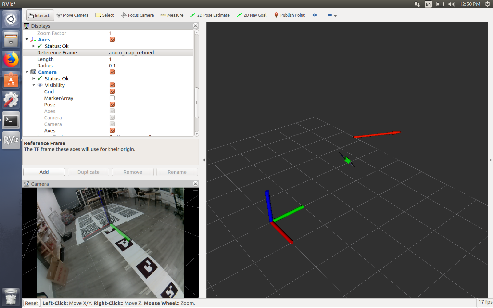
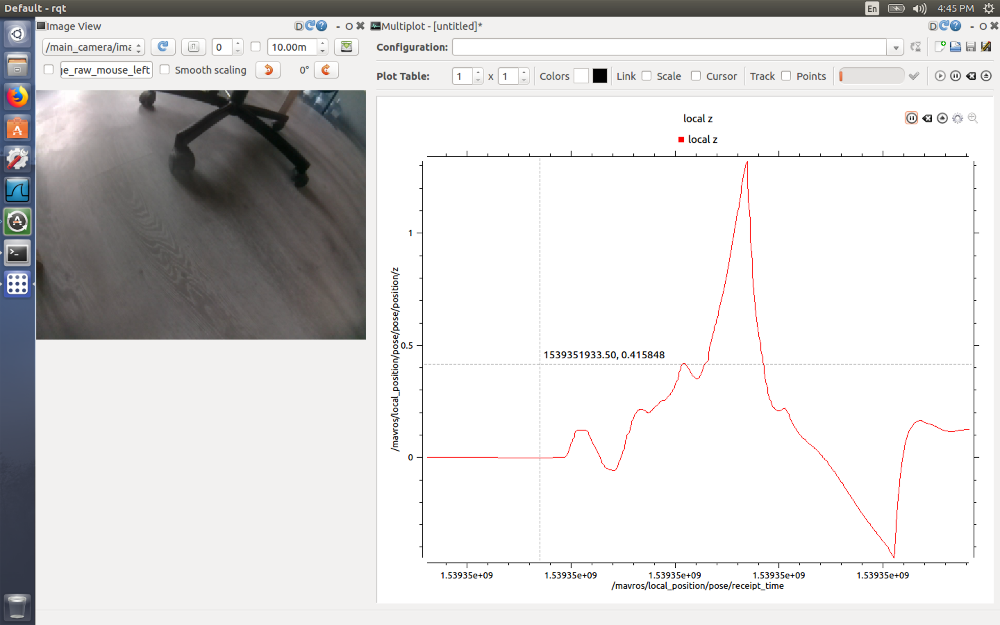

Использование rviz и rqt
===



Инструмент [rviz](http://wiki.ros.org/rviz) позволяет в реальном времени визуализировать на 3D-сцене все компоненты робототехнической системы — системы координат, движущиеся части, показания датчиков, изображения с камер.

[rqt](http://wiki.ros.org/rqt) – это набор GUI для анализа и контроля ROS-систем. Например, `rqt_image_view` позволяет просматривать топики с изображениями, `rqt_multiplot` – строить графики по значениям в топиках и т. д.

Для использования rviz и rqt необходим компьютер с ОС Ubuntu Linux (либо виртуальная машина, например [Parallels Desktop Lite](https://itunes.apple.com/ru/app/parallels-desktop-lite/id1085114709?mt=12) или [VirtualBox](https://www.virtualbox.org)).

На него необходимо установить пакет `ros-kinetic-desktop-full` или `ros-kinetic-desktop`, используя [документацию по установке](http://wiki.ros.org/kinetic/Installation/Ubuntu).

Запуск rviz
---

Для запуска визуализация состояния Клевера в реальном времени, необходимо подключиться к нему по Wi-Fi (`CLEVER-xxx`) и запустить rviz, указав соответствующий ROS_MASTER_URI:

```bash
ROS_MASTER_URI=http://192.168.11.1:11311 rviz
```

Если соединение не устанавливается, необходимо убедиться, что в `.bashrc` Клевера присутствует строка:

```bash
export ROS_HOSTNAME=raspberrypi.local
```

Использование rviz
---

### Визуализация положения коптера

В качестве reference frame рекомендуется установить фрейм `map`. Для визуализации коптера добавьте визуализационные маркеры из топика `/vehicle_markers`. Для визуализации камеры коптера добавьте визуализационные маркеры из топика `/main_camera/camera_markers`.

Результат визуализации коптера и камеры представлен ниже:


### Визуализация окружения

Можно просмотреть картинку с дополненной реальностью из топика основной камеры `/main_camera/image_raw`.

Axis или Grid настроенный на фрейм `aruco_map` будут визуализировать расположение [карты ArUco-меток](aruco.md).

### jsk_rviz_plugins

Рекомендуется также установка набора дополнительных полезных плагинов для rviz [jsk_rviz_plugins](https://jsk-docs.readthedocs.io/en/latest/jsk_visualization/doc/jsk_rviz_plugins/index.html). Это набор позволяет визуализировать топики типа `TwistStamped` (скорость), `CameraInfo`, `PolygonArray` и многое другое. Для установки используйте команду:

```bash
sudo apt-get install ros-kinetic-jsk-visualization
```

Запуск инструментов rqt
---



Для запуска rqt для мониторинга состояния Клевера используйте команду:

```bash
ROS_MASTER_URI=http://192.168.11.1:11311 rqt
```

Пример запуск конкретного плагина (`rqt_image_view`):

```bash
ROS_MASTER_URI=http://192.168.11.1:11311 rqt_image_view
```

Краткое описание полезных rqt-плагинов:

* `rqt_image_view` – просмотр изображений из топиков типа `sensor_msgs/Image`;
* `rqt_multiplot` – построение графиков по данным из произвольным топиков (установка: `sudo apt-get install ros-kinetic-rqt-multiplot`);
* Bag – работа с [Bag-файлами](http://wiki.ros.org/rosbag).
